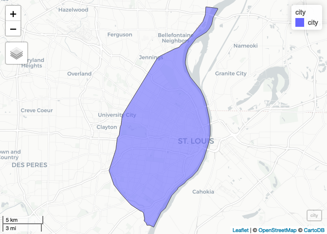
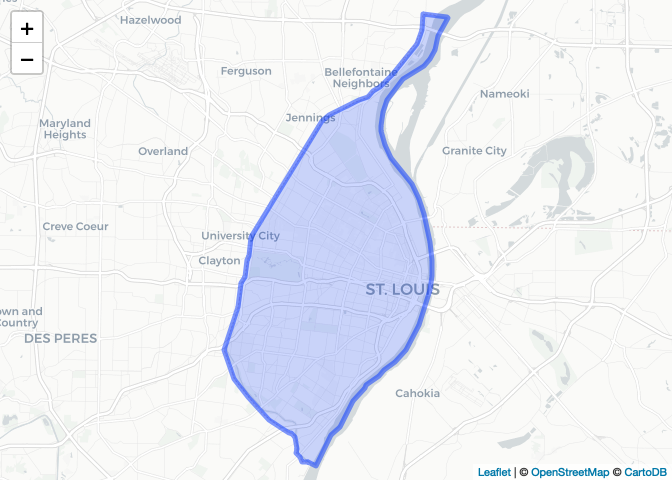
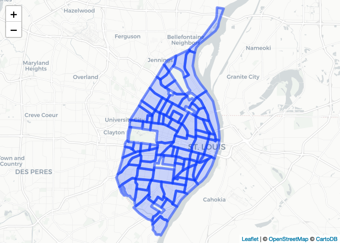
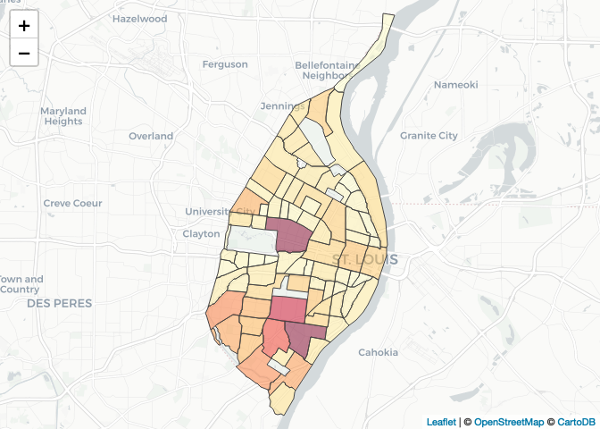
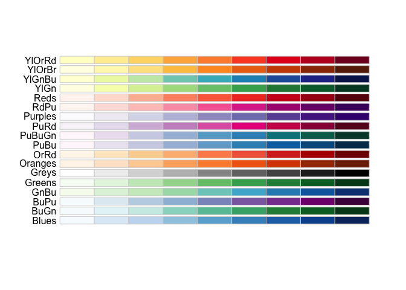
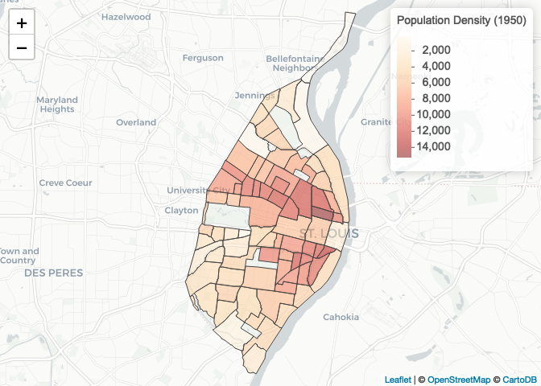

Lecture-05 Examples
================
Christopher Prener, Ph.D.
(February 13, 2019)

## Introduction

This notebook covers basic map production in `R` using a variety of
tools. We’ll review some of what we discussed during
[Lecture-01](https://slu-soc5650.github.io/docs/lecture-01/) and then
introduce two new approaches for mapping.

## Dependencies

This notebook requires a variety of packages for working with spatial
data:

``` r
# spatial packages
library(leaflet)      # interactive maps
library(mapview)      # preview spatial data
library(sf)           # spatial data tools
```

    ## Linking to GEOS 3.6.1, GDAL 2.1.3, PROJ 4.9.3

``` r
# other packages
library(here)         # file path management
```

    ## here() starts at /Users/chris/GitHub/SOC5650/LectureRepos/lecture-05

``` r
library(RColorBrewer) # color palettes
```

For best results, you should also have PhantomJS installed as well:

``` r
webshot::install_phantomjs()
```

## Load Data (Lecture-01 Review)

This notebook requires the data stored in `data/example-data/`. Remember
that we use `sf::st_read()` to load shapefile
data:

``` r
city <- st_read(here("data", "example-data", "STL_BOUNDARY_City", "STL_BOUNDARY_City.shp"), stringsAsFactors = FALSE)
```

    ## Reading layer `STL_BOUNDARY_City' from data source `/Users/chris/GitHub/SOC5650/LectureRepos/lecture-05/data/example-data/STL_BOUNDARY_City/STL_BOUNDARY_City.shp' using driver `ESRI Shapefile'
    ## Simple feature collection with 1 feature and 17 fields
    ## geometry type:  POLYGON
    ## dimension:      XY
    ## bbox:           xmin: -90.32052 ymin: 38.53185 xmax: -90.16657 ymax: 38.77443
    ## epsg (SRID):    NA
    ## proj4string:    +proj=longlat +ellps=GRS80 +no_defs

``` r
nhoods <- st_read(here("data", "example-data", "STL_DEMOS_Nhoods", "STL_DEMOS_Nhoods.shp"), stringsAsFactors = FALSE)
```

    ## Reading layer `STL_DEMOS_Nhoods' from data source `/Users/chris/GitHub/SOC5650/LectureRepos/lecture-05/data/example-data/STL_DEMOS_Nhoods/STL_DEMOS_Nhoods.shp' using driver `ESRI Shapefile'
    ## Simple feature collection with 79 features and 6 fields
    ## geometry type:  MULTIPOLYGON
    ## dimension:      XY
    ## bbox:           xmin: 733361.8 ymin: 4268512 xmax: 745417.9 ymax: 4295501
    ## epsg (SRID):    NA
    ## proj4string:    +proj=utm +zone=15 +ellps=GRS80 +units=m +no_defs

## Projections

We haven’t talked about projections, yet. They are a part of how we
render geometric data on two-dimensional maps. ArcGIS Pro is a bit more
flexible than `R` packages are when it comes to projections For now, the
more important thing to know is that we need to adjust the projection
being used for our data. We’ll use two projections today:

  - WGS 1984 (crs = `4326`)
  - UTM 15N (crs = `32615`)

To ensure that our data are projected correctly, we use
`sf::st_transform()`:

``` r
# city boundary
city <- st_transform(city, crs = 32615)
city84 <- st_transform(city, crs = 4326)

# neighborhood demographics
nhoods <- st_transform(nhoods, crs = 32615)
nhoods84 <- st_transform(nhoods, crs = 4326)
```

## Exploring Data

There are two ways we can explore our data - we can inspect them using
functions that print particular properties of each object, and we can
inspect them visually.

### Listing Properties

The `utils::str()` function gives us a chance to preview the data in
terms of variable names and the a quick snapshot of the data each
variable contains. We can do this for the `city` data:

``` r
str(city)
```

    ## Classes 'sf' and 'data.frame':   1 obs. of  18 variables:
    ##  $ STATEFP : chr "29"
    ##  $ COUNTYFP: chr "510"
    ##  $ COUNTYNS: chr "00767557"
    ##  $ GEOID   : chr "29510"
    ##  $ NAME    : chr "St. Louis"
    ##  $ NAMELSAD: chr "St. Louis city"
    ##  $ LSAD    : chr "25"
    ##  $ CLASSFP : chr "C7"
    ##  $ MTFCC   : chr "G4020"
    ##  $ CSAFP   : chr "476"
    ##  $ CBSAFP  : chr "41180"
    ##  $ METDIVFP: chr NA
    ##  $ FUNCSTAT: chr "F"
    ##  $ ALAND   : chr "160458044"
    ##  $ AWATER  : chr "10670040"
    ##  $ INTPTLAT: chr "+38.6356988"
    ##  $ INTPTLON: chr "-090.2445816"
    ##  $ geometry:sfc_POLYGON of length 1; first list element: List of 1
    ##   ..$ : num [1:660, 1:2] 733360 733361 733429 733433 733447 ...
    ##   ..- attr(*, "class")= chr  "XY" "POLYGON" "sfg"
    ##  - attr(*, "sf_column")= chr "geometry"
    ##  - attr(*, "agr")= Factor w/ 3 levels "constant","aggregate",..: NA NA NA NA NA NA NA NA NA NA ...
    ##   ..- attr(*, "names")= chr  "STATEFP" "COUNTYFP" "COUNTYNS" "GEOID" ...

We can also do this for the `nhoods` data:

``` r
str(nhoods)
```

    ## Classes 'sf' and 'data.frame':   79 obs. of  7 variables:
    ##  $ NHD_NUM  : num  43 29 28 40 41 42 39 44 36 37 ...
    ##  $ NHD_NAME : chr  "Franz Park" "Tiffany" "Botanical Heights" "Kings Oak" ...
    ##  $ pop50    : num  3303 4418 5869 388 2278 ...
    ##  $ pop17    : num  1306 963 1680 449 881 ...
    ##  $ popChange: num  -60.4 -78.2 -71.4 15.7 -61.3 ...
    ##  $ AREA     : num  1023752 547360 1077170 437583 859566 ...
    ##  $ geometry :sfc_MULTIPOLYGON of length 79; first list element: List of 1
    ##   ..$ :List of 1
    ##   .. ..$ : num [1:46, 1:2] 735143 735184 735189 735249 735254 ...
    ##   ..- attr(*, "class")= chr  "XY" "MULTIPOLYGON" "sfg"
    ##  - attr(*, "sf_column")= chr "geometry"
    ##  - attr(*, "agr")= Factor w/ 3 levels "constant","aggregate",..: NA NA NA NA NA NA
    ##   ..- attr(*, "names")= chr  "NHD_NUM" "NHD_NAME" "pop50" "pop17" ...

### Visually Inspecting Objects

We can also visually inspect the tabular data by clicking on objects in
the Environment tab or, alternatively, using `View()` in the console -
`View(city)`. To get a preview of the spatial data, we can use the
`mapview` package’s `mapview()` function. Once the map is created, we
can alter the basemap by clicking the icon under the zoom in and out
buttons. We can preview the tabular data for each feature by clicking on
it:

``` r
mapview(city)
```

<!-- -->

Here is the preview for the `nhoods` data:

``` r
mapview(nhoods)
```

<!-- -->

Getting a sense of how the data are structured, both in terms of their
tabular attributes and geometric properties, is the first thing you
should do when you bring data into `R`.

## Interactive Mapping with `leaflet` (Lecture-01 Review)

### Basic Mapping of Geometric Objects

During Lecture-01, we discussed the creation of interactive maps using
the `leaflet` package. [Leaflet](https://leafletjs.com) is a JavaScript
library for creating interactive maps. It is primarily focused on web
and mobile mapping. The `leaflet` package for `R` provides access to the
JavaScript library.

Leaflet provides a number of basemaps for mapping. If you add map tiles
using `addTiles()`, you’ll get the open street map basemap. Other
basemaps can be added using `addProviderTiles()`. The names of available
options can be found using:

``` r
names(providers)
```

    ##   [1] "OpenStreetMap"                      
    ##   [2] "OpenStreetMap.Mapnik"               
    ##   [3] "OpenStreetMap.BlackAndWhite"        
    ##   [4] "OpenStreetMap.DE"                   
    ##   [5] "OpenStreetMap.CH"                   
    ##   [6] "OpenStreetMap.France"               
    ##   [7] "OpenStreetMap.HOT"                  
    ##   [8] "OpenStreetMap.BZH"                  
    ##   [9] "OpenInfraMap"                       
    ##  [10] "OpenInfraMap.Power"                 
    ##  [11] "OpenInfraMap.Telecom"               
    ##  [12] "OpenInfraMap.Petroleum"             
    ##  [13] "OpenInfraMap.Water"                 
    ##  [14] "OpenSeaMap"                         
    ##  [15] "OpenPtMap"                          
    ##  [16] "OpenTopoMap"                        
    ##  [17] "OpenRailwayMap"                     
    ##  [18] "OpenFireMap"                        
    ##  [19] "SafeCast"                           
    ##  [20] "Thunderforest"                      
    ##  [21] "Thunderforest.OpenCycleMap"         
    ##  [22] "Thunderforest.Transport"            
    ##  [23] "Thunderforest.TransportDark"        
    ##  [24] "Thunderforest.SpinalMap"            
    ##  [25] "Thunderforest.Landscape"            
    ##  [26] "Thunderforest.Outdoors"             
    ##  [27] "Thunderforest.Pioneer"              
    ##  [28] "OpenMapSurfer"                      
    ##  [29] "OpenMapSurfer.Roads"                
    ##  [30] "OpenMapSurfer.AdminBounds"          
    ##  [31] "OpenMapSurfer.Grayscale"            
    ##  [32] "Hydda"                              
    ##  [33] "Hydda.Full"                         
    ##  [34] "Hydda.Base"                         
    ##  [35] "Hydda.RoadsAndLabels"               
    ##  [36] "MapBox"                             
    ##  [37] "Stamen"                             
    ##  [38] "Stamen.Toner"                       
    ##  [39] "Stamen.TonerBackground"             
    ##  [40] "Stamen.TonerHybrid"                 
    ##  [41] "Stamen.TonerLines"                  
    ##  [42] "Stamen.TonerLabels"                 
    ##  [43] "Stamen.TonerLite"                   
    ##  [44] "Stamen.Watercolor"                  
    ##  [45] "Stamen.Terrain"                     
    ##  [46] "Stamen.TerrainBackground"           
    ##  [47] "Stamen.TopOSMRelief"                
    ##  [48] "Stamen.TopOSMFeatures"              
    ##  [49] "Esri"                               
    ##  [50] "Esri.WorldStreetMap"                
    ##  [51] "Esri.DeLorme"                       
    ##  [52] "Esri.WorldTopoMap"                  
    ##  [53] "Esri.WorldImagery"                  
    ##  [54] "Esri.WorldTerrain"                  
    ##  [55] "Esri.WorldShadedRelief"             
    ##  [56] "Esri.WorldPhysical"                 
    ##  [57] "Esri.OceanBasemap"                  
    ##  [58] "Esri.NatGeoWorldMap"                
    ##  [59] "Esri.WorldGrayCanvas"               
    ##  [60] "OpenWeatherMap"                     
    ##  [61] "OpenWeatherMap.Clouds"              
    ##  [62] "OpenWeatherMap.CloudsClassic"       
    ##  [63] "OpenWeatherMap.Precipitation"       
    ##  [64] "OpenWeatherMap.PrecipitationClassic"
    ##  [65] "OpenWeatherMap.Rain"                
    ##  [66] "OpenWeatherMap.RainClassic"         
    ##  [67] "OpenWeatherMap.Pressure"            
    ##  [68] "OpenWeatherMap.PressureContour"     
    ##  [69] "OpenWeatherMap.Wind"                
    ##  [70] "OpenWeatherMap.Temperature"         
    ##  [71] "OpenWeatherMap.Snow"                
    ##  [72] "HERE"                               
    ##  [73] "HERE.normalDay"                     
    ##  [74] "HERE.normalDayCustom"               
    ##  [75] "HERE.normalDayGrey"                 
    ##  [76] "HERE.normalDayMobile"               
    ##  [77] "HERE.normalDayGreyMobile"           
    ##  [78] "HERE.normalDayTransit"              
    ##  [79] "HERE.normalDayTransitMobile"        
    ##  [80] "HERE.normalNight"                   
    ##  [81] "HERE.normalNightMobile"             
    ##  [82] "HERE.normalNightGrey"               
    ##  [83] "HERE.normalNightGreyMobile"         
    ##  [84] "HERE.basicMap"                      
    ##  [85] "HERE.mapLabels"                     
    ##  [86] "HERE.trafficFlow"                   
    ##  [87] "HERE.carnavDayGrey"                 
    ##  [88] "HERE.hybridDay"                     
    ##  [89] "HERE.hybridDayMobile"               
    ##  [90] "HERE.pedestrianDay"                 
    ##  [91] "HERE.pedestrianNight"               
    ##  [92] "HERE.satelliteDay"                  
    ##  [93] "HERE.terrainDay"                    
    ##  [94] "HERE.terrainDayMobile"              
    ##  [95] "FreeMapSK"                          
    ##  [96] "MtbMap"                             
    ##  [97] "CartoDB"                            
    ##  [98] "CartoDB.Positron"                   
    ##  [99] "CartoDB.PositronNoLabels"           
    ## [100] "CartoDB.PositronOnlyLabels"         
    ## [101] "CartoDB.DarkMatter"                 
    ## [102] "CartoDB.DarkMatterNoLabels"         
    ## [103] "CartoDB.DarkMatterOnlyLabels"       
    ## [104] "HikeBike"                           
    ## [105] "HikeBike.HikeBike"                  
    ## [106] "HikeBike.HillShading"               
    ## [107] "BasemapAT"                          
    ## [108] "BasemapAT.basemap"                  
    ## [109] "BasemapAT.grau"                     
    ## [110] "BasemapAT.overlay"                  
    ## [111] "BasemapAT.highdpi"                  
    ## [112] "BasemapAT.orthofoto"                
    ## [113] "nlmaps"                             
    ## [114] "nlmaps.standaard"                   
    ## [115] "nlmaps.pastel"                      
    ## [116] "nlmaps.grijs"                       
    ## [117] "nlmaps.luchtfoto"                   
    ## [118] "NASAGIBS"                           
    ## [119] "NASAGIBS.ModisTerraTrueColorCR"     
    ## [120] "NASAGIBS.ModisTerraBands367CR"      
    ## [121] "NASAGIBS.ViirsEarthAtNight2012"     
    ## [122] "NASAGIBS.ModisTerraLSTDay"          
    ## [123] "NASAGIBS.ModisTerraSnowCover"       
    ## [124] "NASAGIBS.ModisTerraAOD"             
    ## [125] "NASAGIBS.ModisTerraChlorophyll"     
    ## [126] "NLS"                                
    ## [127] "JusticeMap"                         
    ## [128] "JusticeMap.income"                  
    ## [129] "JusticeMap.americanIndian"          
    ## [130] "JusticeMap.asian"                   
    ## [131] "JusticeMap.black"                   
    ## [132] "JusticeMap.hispanic"                
    ## [133] "JusticeMap.multi"                   
    ## [134] "JusticeMap.nonWhite"                
    ## [135] "JusticeMap.white"                   
    ## [136] "JusticeMap.plurality"               
    ## [137] "Wikimedia"

As you can see, there are a ton of choices\! We’ll use
`CartoDB.Positron` here, but feel free to pick one that you like for
assignments if we don’t specify what you should use. Make sure that your
other cartographic selections, such as color, do not clash with your
basemap.

The basic `leaflet` workflow involves piping functions together (the
`%>%` operator). Each time to see the pipe, think of the word “then.”
For example, the following code chunk would read:

1.Take the `city84` object, **then** 2. use it as the basis for creating
a `leaflet` object with `leaflet()`, **then** 3. add a basemap using the
`CartoDB.Positron` tiles, **then** 4. add polygons and create a popup.

``` r
city84 %>%
  leaflet() %>%
  addProviderTiles(providers$CartoDB.Positron) %>%
  addPolygons(popup = ~NAME)
```

<!-- -->

We can get more into the weeds with the neighborhood data since they
have additional features. We can create more detailed popups using the
`base::paste()` function and some html tags. The most important html
tags to know are:

  - `<b>text</b>` - bold text
  - `<em>text</em>` - italicized text
  - `<br>` - line break

<!-- end list -->

``` r
nhoods84 %>%  
  leaflet() %>%
  addProviderTiles(providers$CartoDB.Positron) %>%
  addPolygons(popup = paste("<b>Name:</b> ", nhoods84$NHD_NAME, "<br>",
                            "<b>2017 Population:</b> ", round(nhoods84$pop17, digits = 0)))
```

<!-- -->

### Mapping Quantities with `leaflet`

If we want to turn this into a thematic choropleth map, we can add some
additional parameters to the `addPolygons()` function. The options
included here are:

  - `color` - outline (“stroke”) color for each polygon
  - `weight` - stroke width
  - `opacity` - stroke opacity
  - `smoothFactor` - allows `leaflet` to simplify polygons depending on
    zoom
  - `fillOpacity` - fill opacity
  - `fillColor` - creates the fill itself
  - `highlightOptions` - creates effect when mouse drags over specific
    polygons

What I have here are good default settings for most of these options,
but feel free to experiment\!

When we created our popup, we want to round our values so that we don’t
see the very long real number associated with our data. By using
`base::round(var, digits = 0)`, we round to the nearest integer. `digits
= 2` would give us two decimal places in contrast.

``` r
# create color palette
npal <- colorNumeric("YlOrRd", nhoods84$pop17)

# create leaflet object
nhoods84 %>%
  leaflet() %>%
  addProviderTiles(providers$CartoDB.Positron) %>%
  addPolygons(
    color = "#444444", 
    weight = 1, 
    opacity = 1.0, 
    smoothFactor = 0.5,
    fillOpacity = 0.5,
    fillColor = ~npal(pop17),
    highlightOptions = highlightOptions(color = "white", weight = 2, bringToFront = TRUE),
    popup = paste("<b>Name:</b> ", nhoods84$NHD_NAME, "<br>",
                  "<b>2017 Population:</b> ", round(nhoods84$pop17, digits = 0))) 
```

<!-- -->

Next, we should add a legend to make the map easier to interpret. This
is done with the `addLegend()` argument. The `opacity` argument in
`addLegend()` should match the `fillOpacity` argument in
`addPolygons()`\!

``` r
# create color palette
npal <- colorNumeric("YlOrRd", nhoods84$pop17)

# create map
nhoods84 %>%
  leaflet() %>%
  addProviderTiles(providers$CartoDB.Positron) %>%
  addPolygons(
    color = "#444444", 
    weight = 1, 
    opacity = 1.0, 
    smoothFactor = 0.5,
    fillOpacity = 0.5,
    fillColor = ~npal(pop17),
    highlightOptions = highlightOptions(color = "white", weight = 2, bringToFront = TRUE),
    popup = paste("<b>Name:</b> ", nhoods84$NHD_NAME, "<br>",
                  "<b>2017 Population:</b> ", round(nhoods84$pop17, digits = 0))) %>%
    addLegend(pal = npal, values = ~pop17, opacity = .5, title = "Population (2017)")
```

<!-- -->

The colors come from the `RColorBrewer` package. We can use
`RColorBrewer::display.brewer.all()` to identify other color ramps:

``` r
display.brewer.all(type = "seq")
```

<!-- -->

We’ll try the `YlGnBu` palette on this next map, which normalizes the
data but dividing our `AREA` variable (which is the area of each
neighborhood in square meters) by `1000000`to convert to square
kilometers. We use the `/` mathematical operator to divide our values,
and parentheses to ensure order of operations is respected. We add a
corresponding value to our popup as well:

``` r
# create color palette
npal <- colorNumeric("YlGnBu", nhoods84$pop17/(nhoods84$AREA/1000000))

# create map
nhoods84 %>%
  leaflet() %>%
  addProviderTiles(providers$CartoDB.Positron) %>%
  addPolygons(
    color = "#444444", 
    weight = 1, 
    opacity = 1.0, 
    smoothFactor = 0.5,
    fillOpacity = 0.5,
    fillColor = ~npal(pop17/(AREA/1000000)),
    highlightOptions = highlightOptions(color = "white", weight = 2, bringToFront = TRUE),
    popup = paste("<b>Name:</b> ", nhoods84$NHD_NAME, "<br>",
                  "<b>2017 Population:</b> ", round(nhoods84$pop17, digits = 0), "<br>",
                  "<b>2017 Population per Square Kilometer:</b> ", 
                      round((nhoods84$pop17/(nhoods84$AREA/1000000)), digits = 0))) %>%
    addLegend(pal = npal, values = ~pop17/(AREA/1000000), opacity = .5, 
              title = "Population Density (2017)")
```

<!-- -->

For our final `leaflet` map, we’ll change the color ramp again and
update the map to focus on 1950 instead of 2017:

``` r
# create color palette
npal <- colorNumeric("OrRd", nhoods84$pop50/(nhoods84$AREA/1000000))

# create map
nhoods84 %>%
  leaflet() %>%
  addProviderTiles(providers$CartoDB.Positron) %>%
  addPolygons(
    color = "#444444", 
    weight = 1, 
    smoothFactor = 0.5,
    opacity = 1.0, 
    fillOpacity = 0.5,
    fillColor = ~npal(pop50/(AREA/1000000)),
    highlightOptions = highlightOptions(color = "white", weight = 2, bringToFront = TRUE),
    popup = paste("<b>Name:</b> ", nhoods84$NHD_NAME, "<br>",
                  "<b>1950 Population:</b> ", round(nhoods84$pop50, digits = 0), "<br>",
                  "<b>1950 Population per Square Kilometer:</b> ", 
                      round((nhoods84$pop50/(nhoods84$AREA/1000000)), digits = 0))) %>%
    addLegend(pal = npal, values = ~pop50/(AREA/1000000), opacity = .5, 
              title = "Population Density (1950)")
```

<!-- -->
